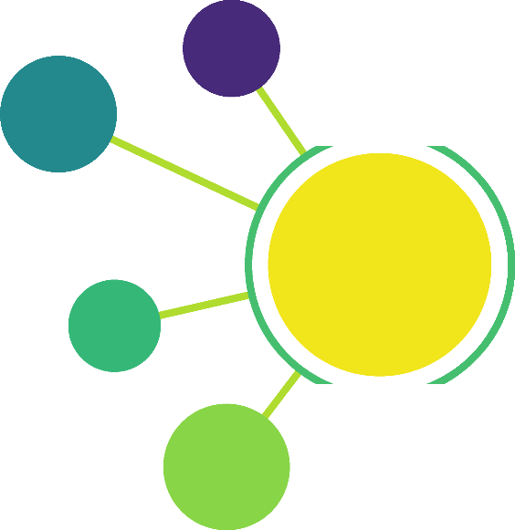

The Morphonets logo was created by an IJ macro!</a>" width="200" height="200">

<h1 align="center">Welcome To Morphonets!</h1>

Morphonets is an open, community-driven effort to provide [ImageJ](https://imagej.net)-based tools for generation, visualization, quantification, and modeling of neuroanatomical data. The tools we create are leveraged by the powerful stack of [Scijava](https://scijava.org)-based software.
Our immediate focus is cellular neuroscience, but the software we develop has been successfully applied to other areas of the biosciences. 

## Projects
Morphonets has incorporated several projects that were previously scattered across the Fiji ecosystem of plugins. Currently, the following major projects are being developed under the Morphonets umbrella:

- [SNT](https://github.com/morphonets/SNT): A complete framework for (semi-)automated tracing and analysis of neurons ([user-based documentation](https://imagej.net/SNT), [publication](https://doi.org/10.1101/2020.07.13.179325)).
- Sholl Analysis: Originally hosted at  https://github.com/tferr/ASA ([Project summary](https://github.com/tferr/ASA#sholl-analysis)), _Sholl Analysis_ has been incorporated into SNT ([user-based documentation](https://imagej.net/Sholl), [publication](https://doi.org/10.1038/nmeth.3125)).
- [Sciview-Cx3D](https://github.com/morphonets/cx3d): A image-based modeling framework powered by Cx3D and [sciview](https://github.com/scenerygraphics/sciview)  ([user-based documentation](https://imagej.net/SNT:_Modeling)).

## Downloads
All projects are available in [Fiji](https://imagej.net/Fiji) by means of two [update sites](https://imagej.net/Update_Sites): *Neuroanatomy* and optionally *Sciview*:

1.  Run the Fiji Updater (*Help › Update...*, the penultimate entry in Fiji's *Help>* menu)
2.  Click *Manage update sites*
3.  Select the *Neuroanatomy* checkbox. Optionally, you can also select the *Sciview* checkbox
4.  Click *Apply changes* and Restart

Problems? Have a look at the [full details](https://github.com/morphonets/SNT#installation).

# Getting Involved
Contact us on [GitHub](https://github.com/morphonets) or the [Image.sc Forum](https://forum.image.sc/)
